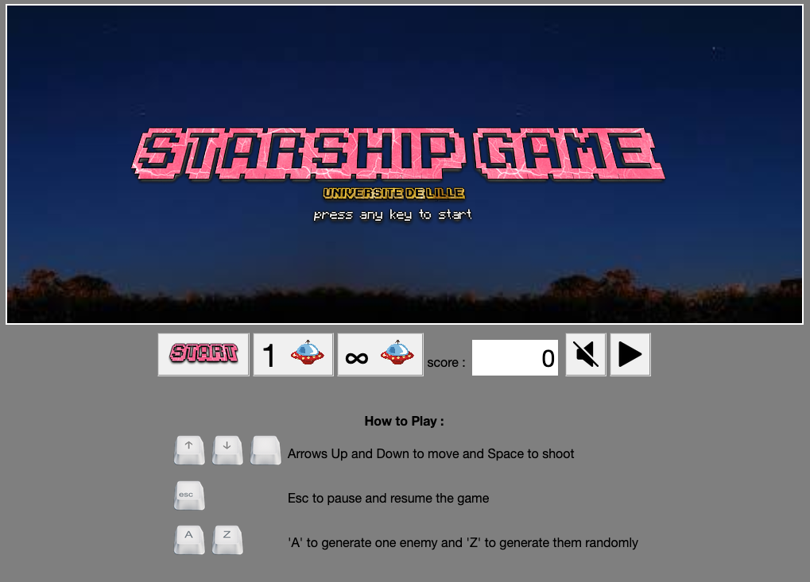
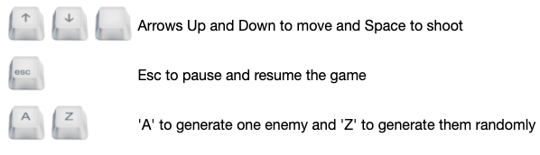

# Starship game :rocket:

## Installation et execution du jeu:

-   commencer par forker le depot.
-   ensuite cloner le projet sur votre depot local.
    -   Pour cela: placer vous dans un dossier de votre choix:
        ```
        $ git clone  <url_git>
        ```
-   une fois cloné nous allons nous placer dans le repertoire du jeu avec la commande:
    ```console
        $ cd starship/
    ```
-   installation des modules nécessaires:

    ```console
        $ npm install
    ```

-   ensuite il faut générer le `/dist` :

    ```console
        $ npm run build
    ```

-   pour executer le jeu il faut ouvrir `/dist/index.html` :

    -   Linux :

    ```console
        $ xdg-open dist/index.html
    ```

    -   MacOs :

    ```console
        $ open dist/index.html
    ```

    -   Windows (cmd) :

    ```console
        $ dist/index.html
    ```

-   Ou bien on peut initialiser un serveur de développement qui va ouvrir automatiquement le `/dist/index.html` :

```console
    $ npm run dev-server
```

## Le jeu

L'objectif est de réaliser un jeu vidéo simple dans lequel le joueur contrôle à l'aide du clavier le déplacement vertical d'un vaisseau situé sur la gauche de l'écran. Des soucoupes volantes arrivent de la droite de l'écran et le joueur doit les détruire en leur tirant dessus. A chaque tir réussi le joueur marque des points, à l'inverse si un vaisseau parvient à passer sans être détruit, le joueur perd des points.



**_Pour commencer a jouer il suffit de cliquer sur n'importe quel touche ou de cliquer sur le bouton start puis choisir le mode de jeu, c'est à dire générer des ennemies
aléatoirement (touche 'A' ou le bouton) ou un par un (touche 'Z' ou le bouton)._**

#### Cliquez ici pour jouer (avec le vpn activé): [Starship](https://webtp.fil.univ-lille1.fr/~elkhayari/starship/dist/index.html)


## Options rajoutés

**_Controle avec les touches :_**



**_Une difficulté progressive :_**

Nous avons rajoutés une difficulté progressive c'est à dire, la vitesse des ennemies et le temps de génération changent selon le score atteint

1. À partir de 2000 de score, le temps de génération des ennemies diminue à 0.65 ms.

1. À partir de 3000 de score, la vitesse de ennemies monte a -4px par frame et le temps de génération des ennemies diminue à 0.60ms.

1. À partir de 4000 de score, le temps de génération des ennemies diminue à 0.55 ms.

1. À partir de 5000 de score, la vitesse de ennemies monte a -5px par frame et le temps de génération des ennemies diminue à 0.50ms.

1. À partir de 6000 de score, le temps de génération des ennemies diminue à 0.45ms.

1. À partir de 7000 de score, la vitesse de ennemies monte a -6px par frame.

1. À partir de 9000 de score, le temps de génération des ennemies diminue à 0.40ms.

1. À partir de 11000 de score, la vitesse de ennemies monte a -7px par frame.

1. À partir de 13000 de score, le temps de génération des ennemies diminue à 0.30ms.

1. À partir de 15000 de score, le temps de génération des ennemies diminue à 0.250ms.

1. À partir de 17000 de score, la vitesse de ennemies monte a -7px par frame.

1. À partir de 19000 de score, la vitesse de ennemies monte a -8px par frame.

1. À partir de 20000 de score, la vitesse de ennemies monte a -9px par frame.

1. À partir de 22000 de score, la vitesse de ennemies monte a -10px par frame.

1. À partir de 25000 de score, la vitesse de ennemies monte a -12px par frame.

1. À partir de 30000 de score, la vitesse de ennemies monte a -16px par frame.

Nous avons également rajouté une animation pour les difficulté, à partir de 3000 de score le shadow du canvas devient vert, à partir de 5000 de score le shadow du canvas devient jaune, à partir de 11000 le shadow canvas devient rouge et à partir de 19000 le shadow des mobiles devient rouge.

**_Effets sonores et animations :_**

Nous avons rajouté des effets sonores et une animation d'explosion lorsqu'un ennemie est touché.

**_Les Boutton :_**

Nous avons rajouté un bouton qui pause et continue le jeu lors du click:

 et 

Pour gérer la musique de fond nous avons rajouté un bouton Play/Pause.

 et 

Et nous avons également rajouté un bouton pour muter les effets sonores.

 et 

### Sources

-   Pour les effets sonores et l'animation de l'explotion : [kenney.nl](https://kenney.nl/assets)
-   Les icones des touches : [iconarchive.com](https://iconarchive.com/show/keyboard-keys-icons-by-chromatix.html)
-   Les typographies que nous avons utilisé : [textcraft.net](https://textcraft.net/)
-   Pour toutes les difficultés que nous avons rencontré : [stackoverflow.com](https://stackoverflow.com)
